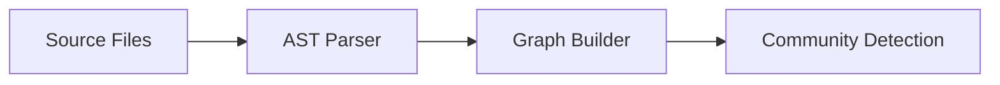
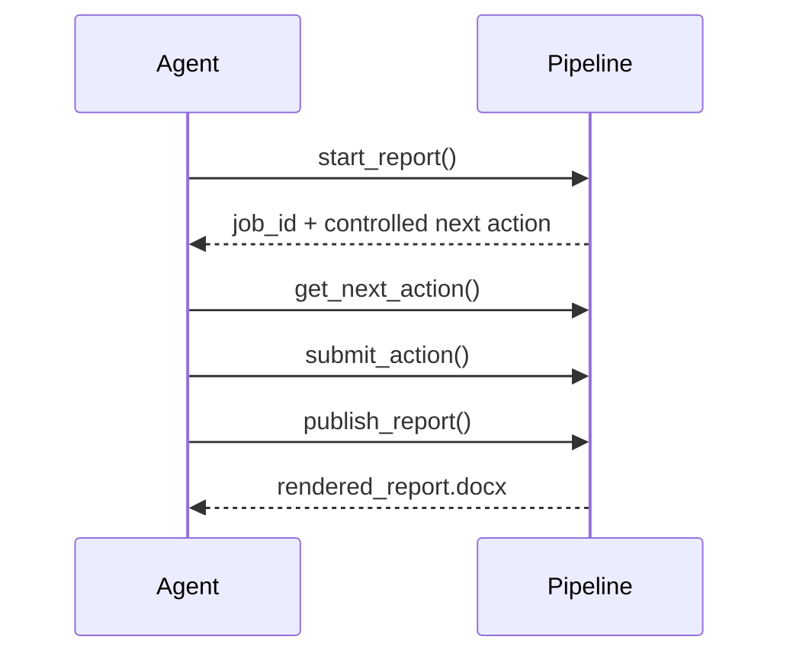

# 03 Section Draft

## Inputs
- Blueprint: `D:\report_workflow\.runs\drone_market_report\Amazon US 無人機市場研究報告：品類結構、價格帶、品牌集中度與買家痛點--run_04af045c\blueprint.json`
- Claim matrix: `D:\report_workflow\.runs\drone_market_report\Amazon US 無人機市場研究報告：品類結構、價格帶、品牌集中度與買家痛點--run_04af045c\claim_matrix.json`
- Outline: `D:\report_workflow\.runs\drone_market_report\Amazon US 無人機市場研究報告：品類結構、價格帶、品牌集中度與買家痛點--run_04af045c\outline.json`
- Evidence ledger: `D:\report_workflow\.runs\drone_market_report\Amazon US 無人機市場研究報告：品類結構、價格帶、品牌集中度與買家痛點--run_04af045c\evidence_ledger.jsonl`
- Figure recommendations: `D:\report_workflow\.runs\drone_market_report\Amazon US 無人機市場研究報告：品類結構、價格帶、品牌集中度與買家痛點--run_04af045c\figure_recommendations.json`

## Required Outputs
- Markdown section files under `D:\report_workflow\.runs\drone_market_report\Amazon US 無人機市場研究報告：品類結構、價格帶、品牌集中度與買家痛點--run_04af045c\section_drafts`
- Sentence map: `D:\report_workflow\.runs\drone_market_report\Amazon US 無人機市場研究報告：品類結構、價格帶、品牌集中度與買家痛點--run_04af045c\sentence_map.jsonl`

Each sentence map line must be JSON:

```json
{"_contract": {
  "job_id": "run_04af045c",
  "evidence_ledger_hash": "cf57169778c2e1b3",
  "source_registry_hash": "525de3e5b77b7205"
}}
{
  "sentence_id": "sent_0",
  "section_id": "results",
  "claim_ids": ["c1"],
  "evidence_ids": ["evidence id from evidence_ledger.jsonl"],
  "citation_ids": ["same evidence id used in [CITE:<id>]"],
  "wording_strength": "measured|hedged|weak",
  "draft_origin": "agent_draft"
}
```

The first line of `sentence_map.jsonl` should be the `_contract` line shown above.
All following lines should be sentence entries.

Do not edit `merged_draft.md` directly. For `new_draft`, fix section files under
`section_drafts/`; the workflow rebuilds merged drafts from them.

## Hard Rules
- Every evidence-backed sentence must include `[CITE:<evidence_id>]` in the Markdown.
- Do not invent claims not present in `claim_matrix.json`.
- Do not write placeholder text such as "This section is under development".
- Use `wording_strength="hedged"` unless the linked evidence is high-grade.
  FD hard-blocks `measured` on medium-grade evidence, quantitative or not.
- Write one Markdown file for each required blueprint section, plus any optional section included in `outline.json`.
- **Publication text forbidden patterns** (hard blocks in the pipeline):
  - `[Source:]`, `[graphify:]`, `[Note:]`, or any internal workflow marker.
  - Evidence IDs, `.py` filenames, or internal workspace paths (e.g. `output/...`) in body text.
  - Any table containing "audit", "evidence", or "claim" in the header; these are internal artifacts.
  - **Write real content; do not use placeholder names** like `[Author Name]`, `[University]`, `[email@domain.com]`.

## Abstract

`business_report` has no abstract section. Do not write one; the blueprint's section list is the whole document.

Only `cover`, `references`, and `appendix` may carry an empty `claim_ids` list
in `outline.json` — they hold front matter, sources, and raw material, not
assertions. A required `cover` section is still required in `outline.json`; it
just carries an empty `claim_ids` list.

## Admissions-facing academic reports

If `report_profile=admissions_report` or `admissions_project_report`, prefer:
- Option B plain-paragraph abstract by default
- project-monograph tone rather than journal-template tone
- research narrative that foregrounds contribution, design choices, and research potential
- deterministic compilation / StrategyIR / AST / orthogonal quality gates as the spine
- LLM components as constrained supporting modules, not co-equal contributions

## Engineering lab reports

If `report_profile=engineering_lab_report`, preserve the lab handout contract:
- cover experiment purpose, theory, apparatus, procedure, results, discussion,
  conclusion/reflection, and references
- keep formulas, variables, parameters, units, and calculation assumptions traceable
- answer required discussion questions from the source handout
- reference figures and tables near the relevant result text
- avoid workflow, agent, or tool jargon in the report body

## How the Reader Grades This

Traceable-to-evidence is the entry ticket, not the goal. The goal is a
document your manager rates highly. Write toward these criteria, in the
document's language:

- Conclusion first, supporting detail after; the reader decides in the first half page whether to keep reading.
- Each metric leads somewhere: a decision, an action, or an explicitly flagged risk.
- Next steps are explicit — owned and dated, not implied.

## Structure Discipline (from published writing standards)

Paragraph rule (Kording & Mensh, PLOS Comput Biol 2017): every
paragraph is Context → Content → Conclusion. The first sentence
states what the paragraph is about; the last states what the reader
should remember. A run of parallel evidence sentences with no
concluding sentence reads as a list, not an argument.

Answer first (Minto's Pyramid Principle): the conclusion leads,
then the two or three supports, then the evidence. Open with
SCQA — situation, complication, the question it raises, and your
answer.

## Derived Statistics (citable, computed from the source rows)

These are ordinary evidence entries whose values the pipeline computed
from the rows, so citing one puts a checked figure in the document.
They are listed here in full because they sit at the end of the ledger,
past the sample the Evidence Summary shows.

Computed automatically at intake (25):

### `E_28767e63_00b29bbe70` — cite with `[CITE:E_28767e63_00b29bbe70]`.

```
衍生統計(來源:amazon_products.csv):本樣本共收錄 544 筆資料列，總筆數 544 筆，欄位 12 個。各欄有值筆數為 asin 544 筆、title 544 筆、brand 207 筆、seller 11 筆、model 64 筆、price 425 筆、rating 376 筆、review_count 333 筆、sales 165 筆、product_link 544 筆、image_url 544 筆、keyword 544 筆。
```
### `E_28767e63_afdac4a7c6` — cite with `[CITE:E_28767e63_afdac4a7c6]`.

```
衍生統計(來源:amazon_products.csv):brand 欄共 54 個相異值、207 筆有值資料列。分布為 DJI 92 筆(44.4%)、Holy Stone 10 筆(4.8%)、Contixo 9 筆(4.3%)、Potensic 9 筆(4.3%)、BetaFPV 8 筆(3.9%)、Antigravity 6 筆(2.9%)、Autel 6 筆(2.9%)、Cozyego 4 筆(1.9%)、Ruko 4 筆(1.9%)、MAD COMPONENTS 3 筆(1.4%)、Parrot 3 筆(1.4%)、Bwine 2 筆(1.0%)、CADDXFPV 2 筆(1.0%)、MOCVOO 2 筆(1.0%)、Midzooparts 2 筆(1.0%)。前五大合計佔 61.8%，以此欄計算的 HHI 為 2097。
```
### `E_28767e63_c52b27b8f6` — cite with `[CITE:E_28767e63_c52b27b8f6]`.

```
衍生統計(來源:amazon_products.csv):seller 欄共 11 個相異值、11 筆有值資料列。分布為 BraveEdge Tech 1 筆(9.1%)、DJI Gear Center 1 筆(9.1%)、Derry Tech 1 筆(9.1%)、DroneFinds-Hub 1 筆(9.1%)、HOVERAir Official 1 筆(9.1%)、Maxuparts 1 筆(9.1%)、Precision Delivery LLC 1 筆(9.1%)、SkywalkerRC 1 筆(9.1%)、XYY PARTS STORE 1 筆(9.1%)、one-martian 1 筆(9.1%)、zhengzhouhonglushangmaoyouxiangongsi 1 筆(9.1%)。前五大合計佔 45.5%，以此欄計算的 HHI 為 909。
```
### `E_28767e63_a5713cf10f` — cite with `[CITE:E_28767e63_a5713cf10f]`.

```
衍生統計(來源:amazon_products.csv):model 欄共 59 個相異值、64 筆有值資料列。分布為 DJI Mini 3 3 筆(4.7%)、DJI Mini 4 Pro 2 筆(3.1%)、DJI Neo 2 筆(3.1%)、DSDR23A 2 筆(3.1%)、8112 IPE Silver 100KV 1 筆(1.6%)、ATOM 2 1 筆(1.6%)、Air65 II 1 筆(1.6%)、Avatar Pro Kit 1 筆(1.6%)、BAT S Series RC Quadcopter Motor 1 筆(1.6%)、Brushless Motor 1 筆(1.6%)、CxzHtv86564 1 筆(1.6%)、D20 1 筆(1.6%)、DJI Avata 2 1 筆(1.6%)、DJI Mini 5 Pro 1 筆(1.6%)、DJI NEO 2 1 筆(1.6%)。前五大合計佔 15.6%，以此欄計算的 HHI 為 186。
```
### `E_28767e63_020c41e5a7` — cite with `[CITE:E_28767e63_020c41e5a7]`.

```
衍生統計(來源:amazon_products.csv):price 欄共 425 筆數值，最小值 0 USD，第一四分位 32.99 USD，中位數 71.99 USD，平均數 735.50 USD，第三四分位 269.99 USD，最大值 36,999 USD。
```
### `E_28767e63_542da20982` — cite with `[CITE:E_28767e63_542da20982]`.

```
衍生統計(來源:amazon_products.csv):rating 欄共 376 筆數值，最小值 1.80，第一四分位 4，中位數 4.30，平均數 4.26，第三四分位 4.60，最大值 5。
```
### `E_28767e63_c1485e6c92` — cite with `[CITE:E_28767e63_c1485e6c92]`.

```
衍生統計(來源:amazon_products.csv):review_count 欄共 333 筆數值，最小值 1，第一四分位 13，中位數 70，平均數 945.92，第三四分位 515，最大值 33,535。
```
### `E_28767e63_4f305b8385` — cite with `[CITE:E_28767e63_4f305b8385]`.

```
衍生統計(來源:amazon_products.csv):sales 欄共 15 個相異值、165 筆有值資料列。分布為 100+ bought in past month 46 筆(27.9%)、50+ bought in past month 34 筆(20.6%)、200+ bought in past month 22 筆(13.3%)、500+ bought in past month 16 筆(9.7%)、400+ bought in past month 12 筆(7.3%)、1K+ bought in past month 11 筆(6.7%)、300+ bought in past month 11 筆(6.7%)、2K+ bought in past month 5 筆(3.0%)、3K+ bought in past month 2 筆(1.2%)、10K+ bought in past month 1 筆(0.6%)、4K+ bought in past month 1 筆(0.6%)、5K+ bought in past month 1 筆(0.6%)、600+ bought in past month 1 筆(0.6%)、6K+ bought in past month 1 筆(0.6%)、8K+ bought in past month 1 筆(0.6%)。前五大合計佔 78.8%，以此欄計算的 HHI 為 1628。
```
### `E_28767e63_2f658f6efa` — cite with `[CITE:E_28767e63_2f658f6efa]`.

```
衍生統計(來源:amazon_products.csv):keyword 欄共 4 個相異值、544 筆有值資料列。分布為 drone 279 筆(51.3%)、agricultural spray drone 111 筆(20.4%)、drone brushless motor 102 筆(18.8%)、thermal imaging drone 52 筆(9.6%)。前五大合計佔 100.0%，以此欄計算的 HHI 為 3490。
```
### `E_28767e63_ed49ab53fd`
Place this table with `[TABLE:E_28767e63_ed49ab53fd <caption>]`; the renderer rebuilds it as a real Word table with its provenance underneath. Cite a number you discuss in the prose with `[CITE:E_28767e63_ed49ab53fd]`.

```
衍生統計(來源:amazon_products.csv):keyword 分組交叉表。依 keyword 分為 4 組，涵蓋 544 筆資料列（全檔 544 筆）。
keyword | 筆數 | 佔比 | price 平均 | price 中位數 | rating 平均 | rating 中位數 | review_count 中位數
drone | 279 | 51.29% | 1,085.70 USD | 99.97 USD | 4.27 | 4.30 | 197.00
agricultural spray drone | 111 | 20.40% | 705.99 USD | 113.29 USD | 3.77 | 3.95 | 11.50
drone brushless motor | 102 | 18.75% | 56.45 USD | 33.61 USD | 4.38 | 4.40 | 14.00
thermal imaging drone | 52 | 9.56% | 298.69 USD | 124.99 USD | 4.25 | 4.40 | 92.00
合計 | 544 | 100.00% | 735.50 USD | 71.99 USD | 4.26 | 4.30 | 70.00
```
### `E_28767e63_afbea52c52`
Place this table with `[TABLE:E_28767e63_afbea52c52 <caption>]`; the renderer rebuilds it as a real Word table with its provenance underneath. Cite a number you discuss in the prose with `[CITE:E_28767e63_afbea52c52]`.

```
衍生統計(來源:amazon_products.csv):brand 分組交叉表。依 brand 分為 16 組，涵蓋 207 筆資料列（全檔 544 筆）。另有 337 筆在該欄無可用值，未列入分組。
brand | 筆數 | 佔比 | price 平均 | price 中位數 | rating 平均 | rating 中位數 | review_count 中位數
DJI | 92 | 16.91% | 1,077.30 USD | 247.50 USD | 4.39 | 4.50 | 307.00
Holy Stone | 10 | 1.84% | 138.40 USD | 139.99 USD | 4.13 | 4.20 | 2,780.00
Contixo | 9 | 1.65% | 209.43 USD | 149.99 USD | 3.64 | 3.70 | 28.00
Potensic | 9 | 1.65% | 323.77 USD | 279.99 USD | 4.49 | 4.50 | 1,871.00
BetaFPV | 8 | 1.47% | 152.12 USD | 117.99 USD | 4.04 | 4.00 | 12.00
Antigravity | 6 | 1.10% | 1,599.00 USD | 1,599.00 USD | 4.20 | 4.60 | 1.00
Autel | 6 | 1.10% | 3,979.00 USD | 3,289.00 USD | 4.47 | 4.50 | 11.00
Cozyego | 4 | 0.74% | 61.23 USD | 56.98 USD | 4.65 | 4.85 | 4.00
Ruko | 4 | 0.74% | 454.99 USD | 449.99 USD | 4.45 | 4.45 | 175.50
MAD COMPONENTS | 3 | 0.55% | 182.99 USD | 227.99 USD | — | — | —
Parrot | 3 | 0.55% | — | — | 3.80 | 3.80 | 198.00
Bwine | 2 | 0.37% | 399.98 USD | 399.98 USD | 4.45 | 4.45 | 794.00
CADDXFPV | 2 | 0.37% | 149.99 USD | 149.99 USD | 3.15 | 3.15 | 39.00
MOCVOO | 2 | 0.37% | 26.99 USD | 26.99 USD | 3.75 | 3.75 | 901.00
Midzooparts | 2 | 0.37% | 66.14 USD | 66.14 USD | — | — | —
其他（39 組） | 45 | 8.27% | 470.16 USD | 59.99 USD | 4.30 | 4.30 | 82.00
合計 | 207 | 38.05% | 714.22 USD | 119.99 USD | 4.29 | 4.40 | 140.00
```
### `E_28767e63_1af1b725ea`
Place this table with `[TABLE:E_28767e63_1af1b725ea <caption>]`; the renderer rebuilds it as a real Word table with its provenance underneath. Cite a number you discuss in the prose with `[CITE:E_28767e63_1af1b725ea]`.

```
衍生統計(來源:amazon_products.csv):sales 分組交叉表。依 sales 分為 15 組，涵蓋 165 筆資料列（全檔 544 筆）。另有 379 筆在該欄無可用值，未列入分組。
sales | 筆數 | 佔比 | price 平均 | price 中位數 | rating 平均 | rating 中位數 | review_count 中位數
100+ bought in past month | 46 | 8.46% | 362.10 USD | 89.99 USD | 4.22 | 4.35 | 198.00
50+ bought in past month | 34 | 6.25% | 101.56 USD | 57.99 USD | 4.24 | 4.20 | 121.00
200+ bought in past month | 22 | 4.04% | 122.09 USD | 119.98 USD | 4.28 | 4.25 | 794.00
500+ bought in past month | 16 | 2.94% | 245.15 USD | 139.99 USD | 4.37 | 4.40 | 806.00
400+ bought in past month | 12 | 2.21% | 201.17 USD | 47.99 USD | 4.38 | 4.35 | 413.00
1K+ bought in past month | 11 | 2.02% | 68.58 USD | 41.36 USD | 4.42 | 4.50 | 776.50
300+ bought in past month | 11 | 2.02% | 500.32 USD | 236.00 USD | 4.40 | 4.40 | 327.00
2K+ bought in past month | 5 | 0.92% | 323.89 USD | 59.97 USD | 4.32 | 4.40 | 1,166.00
3K+ bought in past month | 2 | 0.37% | 214.49 USD | 214.49 USD | 4.35 | 4.35 | 1,796.50
10K+ bought in past month | 1 | 0.18% | 35.99 USD | 35.99 USD | 4.40 | 4.40 | 33,535.00
4K+ bought in past month | 1 | 0.18% | 299.00 USD | 299.00 USD | 4.50 | 4.50 | 3,965.00
5K+ bought in past month | 1 | 0.18% | 29.58 USD | 29.58 USD | 4.00 | 4.00 | —
600+ bought in past month | 1 | 0.18% | 49.98 USD | 49.98 USD | 3.90 | 3.90 | 131.00
6K+ bought in past month | 1 | 0.18% | 49.99 USD | 49.99 USD | 4.60 | 4.60 | 8,639.00
8K+ bought in past month | 1 | 0.18% | 64.98 USD | 64.98 USD | 4.60 | 4.60 | 8,830.00
合計 | 165 | 30.33% | 227.31 USD | 69.99 USD | 4.29 | 4.30 | 328.00
```
### `E_28767e63_38f7a0a2a0`
Place this table with `[TABLE:E_28767e63_38f7a0a2a0 <caption>]`; the renderer rebuilds it as a real Word table with its provenance underneath. Cite a number you discuss in the prose with `[CITE:E_28767e63_38f7a0a2a0]`.

```
衍生統計(來源:amazon_products.csv):model 分組交叉表。依 model 分為 16 組，涵蓋 64 筆資料列（全檔 544 筆）。另有 480 筆在該欄無可用值，未列入分組。
model | 筆數 | 佔比 | price 平均 | price 中位數 | rating 平均 | rating 中位數 | review_count 中位數
DJI Mini 3 | 3 | 0.55% | — | — | 4.53 | 4.50 | 2,547.00
DJI Mini 4 Pro | 2 | 0.37% | — | — | 4.45 | 4.45 | 2,402.00
DJI Neo | 2 | 0.37% | — | — | 4.50 | 4.50 | 2,585.00
DSDR23A | 2 | 0.37% | 416.99 USD | 416.99 USD | 4.50 | 4.50 | 1,871.50
8112 IPE Silver 100KV | 1 | 0.18% | 227.99 USD | 227.99 USD | — | — | —
ATOM 2 | 1 | 0.18% | 249.99 USD | 249.99 USD | 4.70 | 4.70 | 23.00
Air65 II | 1 | 0.18% | 115.99 USD | 115.99 USD | 5.00 | 5.00 | 4.00
Avatar Pro Kit | 1 | 0.18% | 169.99 USD | 169.99 USD | 4.50 | 4.50 | 75.00
BAT S Series RC Quadcopter Motor | 1 | 0.18% | 65.92 USD | 65.92 USD | — | — | —
Brushless Motor | 1 | 0.18% | 24.99 USD | 24.99 USD | 5.00 | 5.00 | 1.00
CxzHtv86564 | 1 | 0.18% | 1,236.14 USD | 1,236.14 USD | — | — | —
D20 | 1 | 0.18% | 49.99 USD | 49.99 USD | 4.00 | 4.00 | 19,425.00
DJI Avata 2 | 1 | 0.18% | — | — | 4.60 | 4.60 | 515.00
DJI Mini 5 Pro | 1 | 0.18% | 1,159.00 USD | 1,159.00 USD | 4.40 | 4.40 | 698.00
DJI NEO 2 | 1 | 0.18% | — | — | 4.60 | 4.60 | 858.00
其他（44 組） | 44 | 8.09% | 166.30 USD | 72.49 USD | 4.08 | 4.20 | 115.00
合計 | 64 | 11.76% | 211.49 USD | 92.99 USD | 4.22 | 4.40 | 260.00
```
### `E_7b036ce9_bb4c554261` — cite with `[CITE:E_7b036ce9_bb4c554261]`.

```
衍生統計(來源:amazon_classified.csv):本樣本共收錄 544 筆資料列，總筆數 544 筆，欄位 9 個。各欄有值筆數為 asin 544 筆、title 544 筆、brand 207 筆、price 425 筆、sales 165 筆、review_count 333 筆、category 544 筆、score 544 筆、matched 503 筆。
```
### `E_7b036ce9_946f23cfa1` — cite with `[CITE:E_7b036ce9_946f23cfa1]`.

```
衍生統計(來源:amazon_classified.csv):brand 欄共 54 個相異值、207 筆有值資料列。分布為 DJI 92 筆(44.4%)、Holy Stone 10 筆(4.8%)、Contixo 9 筆(4.3%)、Potensic 9 筆(4.3%)、BetaFPV 8 筆(3.9%)、Antigravity 6 筆(2.9%)、Autel 6 筆(2.9%)、Cozyego 4 筆(1.9%)、Ruko 4 筆(1.9%)、MAD COMPONENTS 3 筆(1.4%)、Parrot 3 筆(1.4%)、Bwine 2 筆(1.0%)、CADDXFPV 2 筆(1.0%)、MOCVOO 2 筆(1.0%)、Midzooparts 2 筆(1.0%)。前五大合計佔 61.8%，以此欄計算的 HHI 為 2097。
```
### `E_7b036ce9_3277293859` — cite with `[CITE:E_7b036ce9_3277293859]`.

```
衍生統計(來源:amazon_classified.csv):price 欄共 425 筆數值，最小值 0 USD，第一四分位 32.99 USD，中位數 71.99 USD，平均數 735.50 USD，第三四分位 269.99 USD，最大值 36,999 USD。
```
### `E_7b036ce9_0cb75ded9f` — cite with `[CITE:E_7b036ce9_0cb75ded9f]`.

```
衍生統計(來源:amazon_classified.csv):sales 欄共 15 個相異值、165 筆有值資料列。分布為 100+ bought in past month 46 筆(27.9%)、50+ bought in past month 34 筆(20.6%)、200+ bought in past month 22 筆(13.3%)、500+ bought in past month 16 筆(9.7%)、400+ bought in past month 12 筆(7.3%)、1K+ bought in past month 11 筆(6.7%)、300+ bought in past month 11 筆(6.7%)、2K+ bought in past month 5 筆(3.0%)、3K+ bought in past month 2 筆(1.2%)、10K+ bought in past month 1 筆(0.6%)、4K+ bought in past month 1 筆(0.6%)、5K+ bought in past month 1 筆(0.6%)、600+ bought in past month 1 筆(0.6%)、6K+ bought in past month 1 筆(0.6%)、8K+ bought in past month 1 筆(0.6%)。前五大合計佔 78.8%，以此欄計算的 HHI 為 1628。
```
### `E_7b036ce9_0bf8d22c42` — cite with `[CITE:E_7b036ce9_0bf8d22c42]`.

```
衍生統計(來源:amazon_classified.csv):review_count 欄共 333 筆數值，最小值 1，第一四分位 13，中位數 70，平均數 945.92，第三四分位 515，最大值 33,535。
```
### `E_7b036ce9_272ec71407` — cite with `[CITE:E_7b036ce9_272ec71407]`.

```
衍生統計(來源:amazon_classified.csv):category 欄共 8 個相異值、544 筆有值資料列。分布為 攝影 243 筆(44.7%)、無人機馬達 77 筆(14.2%)、配件/零件 71 筆(13.1%)、植保 63 筆(11.6%)、非無人機商品 46 筆(8.5%)、消費級/其他 22 筆(4.0%)、多用途 14 筆(2.6%)、消防投彈 8 筆(1.5%)。前五大合計佔 91.9%，以此欄計算的 HHI 為 2597。
```
### `E_7b036ce9_36ca2d0b67` — cite with `[CITE:E_7b036ce9_36ca2d0b67]`.

```
衍生統計(來源:amazon_classified.csv):score 欄共 544 筆數值，最小值 0，第一四分位 0，中位數 2，平均數 2.89，第三四分位 4，最大值 15。
```
### `E_7b036ce9_337d76a7e2`
Place this table with `[TABLE:E_7b036ce9_337d76a7e2 <caption>]`; the renderer rebuilds it as a real Word table with its provenance underneath. Cite a number you discuss in the prose with `[CITE:E_7b036ce9_337d76a7e2]`.

```
衍生統計(來源:amazon_classified.csv):category 分組交叉表。依 category 分為 8 組，涵蓋 544 筆資料列（全檔 544 筆）。
category | 筆數 | 佔比 | price 平均 | price 中位數 | review_count 平均 | review_count 中位數 | score 中位數
攝影 | 243 | 44.67% | 535.95 USD | 139.98 USD | 1,115.95 | 225.00 | 4.00
無人機馬達 | 77 | 14.15% | 54.02 USD | 32.70 USD | 48.08 | 14.00 | 2.00
配件/零件 | 71 | 13.05% | 514.52 USD | 79.58 USD | 281.70 | 51.00 | 0.00
植保 | 63 | 11.58% | 1,008.44 USD | 122.46 USD | 176.57 | 1.00 | 6.00
非無人機商品 | 46 | 8.46% | 1,976.10 USD | 29.97 USD | 1,918.41 | 23.50 | 0.00
消費級/其他 | 22 | 4.04% | 43.13 USD | 38.97 USD | 2,658.00 | 223.00 | 0.00
多用途 | 14 | 2.57% | 4,800.36 USD | 3,579.00 USD | 7.43 | 5.00 | 0.00
消防投彈 | 8 | 1.47% | 359.08 USD | 39.99 USD | 30.17 | 12.00 | 2.00
合計 | 544 | 100.00% | 735.50 USD | 71.99 USD | 945.92 | 70.00 | 2.00
```
### `E_7b036ce9_67b56b611c`
Place this table with `[TABLE:E_7b036ce9_67b56b611c <caption>]`; the renderer rebuilds it as a real Word table with its provenance underneath. Cite a number you discuss in the prose with `[CITE:E_7b036ce9_67b56b611c]`.

```
衍生統計(來源:amazon_classified.csv):brand 分組交叉表。依 brand 分為 16 組，涵蓋 207 筆資料列（全檔 544 筆）。另有 337 筆在該欄無可用值，未列入分組。
brand | 筆數 | 佔比 | price 平均 | price 中位數 | review_count 平均 | review_count 中位數 | score 中位數
DJI | 92 | 16.91% | 1,077.30 USD | 247.50 USD | 1,151.12 | 307.00 | 3.00
Holy Stone | 10 | 1.84% | 138.40 USD | 139.99 USD | 6,091.57 | 2,780.00 | 3.00
Contixo | 9 | 1.65% | 209.43 USD | 149.99 USD | 42.86 | 28.00 | 3.00
Potensic | 9 | 1.65% | 323.77 USD | 279.99 USD | 2,604.33 | 1,871.00 | 6.00
BetaFPV | 8 | 1.47% | 152.12 USD | 117.99 USD | 53.29 | 12.00 | 2.50
Antigravity | 6 | 1.10% | 1,599.00 USD | 1,599.00 USD | 36.33 | 1.00 | 2.00
Autel | 6 | 1.10% | 3,979.00 USD | 3,289.00 USD | 53.00 | 11.00 | 2.00
Cozyego | 4 | 0.74% | 61.23 USD | 56.98 USD | 3.50 | 4.00 | 2.00
Ruko | 4 | 0.74% | 454.99 USD | 449.99 USD | 356.50 | 175.50 | 11.00
MAD COMPONENTS | 3 | 0.55% | 182.99 USD | 227.99 USD | — | — | 2.00
Parrot | 3 | 0.55% | — | — | 489.00 | 198.00 | 1.00
Bwine | 2 | 0.37% | 399.98 USD | 399.98 USD | 794.00 | 794.00 | 9.50
CADDXFPV | 2 | 0.37% | 149.99 USD | 149.99 USD | 39.00 | 39.00 | 3.00
MOCVOO | 2 | 0.37% | 26.99 USD | 26.99 USD | 901.00 | 901.00 | 4.00
Midzooparts | 2 | 0.37% | 66.14 USD | 66.14 USD | — | — | 5.00
其他（39 組） | 45 | 8.27% | 470.16 USD | 59.99 USD | 1,121.08 | 82.00 | 2.00
合計 | 207 | 38.05% | 714.22 USD | 119.99 USD | 1,206.95 | 140.00 | 3.00
```
### `E_7b036ce9_c337cda8ba`
Place this table with `[TABLE:E_7b036ce9_c337cda8ba <caption>]`; the renderer rebuilds it as a real Word table with its provenance underneath. Cite a number you discuss in the prose with `[CITE:E_7b036ce9_c337cda8ba]`.

```
衍生統計(來源:amazon_classified.csv):sales 分組交叉表。依 sales 分為 15 組，涵蓋 165 筆資料列（全檔 544 筆）。另有 379 筆在該欄無可用值，未列入分組。
sales | 筆數 | 佔比 | price 平均 | price 中位數 | review_count 平均 | review_count 中位數 | score 中位數
100+ bought in past month | 46 | 8.46% | 362.10 USD | 89.99 USD | 698.48 | 198.00 | 3.50
50+ bought in past month | 34 | 6.25% | 101.56 USD | 57.99 USD | 903.19 | 121.00 | 2.00
200+ bought in past month | 22 | 4.04% | 122.09 USD | 119.98 USD | 1,961.20 | 794.00 | 4.00
500+ bought in past month | 16 | 2.94% | 245.15 USD | 139.99 USD | 2,555.93 | 806.00 | 4.00
400+ bought in past month | 12 | 2.21% | 201.17 USD | 47.99 USD | 1,204.08 | 413.00 | 3.00
1K+ bought in past month | 11 | 2.02% | 68.58 USD | 41.36 USD | 3,215.00 | 776.50 | 2.00
300+ bought in past month | 11 | 2.02% | 500.32 USD | 236.00 USD | 923.00 | 327.00 | 5.00
2K+ bought in past month | 5 | 0.92% | 323.89 USD | 59.97 USD | 2,303.50 | 1,166.00 | 3.00
3K+ bought in past month | 2 | 0.37% | 214.49 USD | 214.49 USD | 1,796.50 | 1,796.50 | 6.00
10K+ bought in past month | 1 | 0.18% | 35.99 USD | 35.99 USD | 33,535.00 | 33,535.00 | 0.00
4K+ bought in past month | 1 | 0.18% | 299.00 USD | 299.00 USD | 3,965.00 | 3,965.00 | 9.00
5K+ bought in past month | 1 | 0.18% | 29.58 USD | 29.58 USD | — | — | 0.00
600+ bought in past month | 1 | 0.18% | 49.98 USD | 49.98 USD | 131.00 | 131.00 | 3.00
6K+ bought in past month | 1 | 0.18% | 49.99 USD | 49.99 USD | 8,639.00 | 8,639.00 | 5.00
8K+ bought in past month | 1 | 0.18% | 64.98 USD | 64.98 USD | 8,830.00 | 8,830.00 | 5.00
合計 | 165 | 30.33% | 227.31 USD | 69.99 USD | 1,747.59 | 328.00 | 3.00
```
### `E_0d77ee19_abffba77dd` — cite with `[CITE:E_0d77ee19_abffba77dd]`.

```
衍生統計(來源:amazon_reviews.csv):本樣本共收錄 473 筆資料列，總筆數 473 筆，欄位 6 個。各欄有值筆數為 review_id 473 筆、asin 473 筆、review_rating 473 筆、review_title 382 筆、review_body 473 筆、review_date 382 筆。
```
### `E_0d77ee19_8eb9aa068f` — cite with `[CITE:E_0d77ee19_8eb9aa068f]`.

```
衍生統計(來源:amazon_reviews.csv):review_rating 欄共 473 筆數值，最小值 1，第一四分位 4，中位數 5，平均數 4.41，第三四分位 5，最大值 5。
```

Registered by request: none yet — see the registration guide below.


## Prose Quality (applies to every profile)

The gates check grounding; they do not fix machine-sounding prose. These rules
keep the rendered document reading like it was written by a person:

1. **Translate data identifiers into plain language.** Column and field names
   are source metadata, not prose. Write "median processing time
   (12.4 minutes)", never `median_processing_minutes`; "the structured
   workflow condition", never `structured_workflow`. Snake_case or camelCase
   tokens in body text, headings, or captions are a defect.
2. **State the grounded numbers.** When evidence contains the value, write the
   value: "the error rate fell from 9.0% to 3.5%", not "the error rate was
   lower". A quantitative section with no numbers reads as evasive even when
   every claim is verified. Reuse the evidence's own figures and units so the
   content checks pass untouched.
3. **No internal identifiers in publication text.** Recommendation ids
   (`figrec_1`), evidence ids (`E001`), artifact filenames
   (`chart_source.csv`, `outline.json`), and run/job ids must never appear in
   body text or captions. Refer to figures as "Figure 1", to data by its
   real-world name ("the intake-time measurements").
4. **Captions describe the finding, not the mechanics.** "Figure 1: Median
   processing time per note, manual baseline vs structured workflow (minutes)"
   — not "Figure 1: Bar view of chart_source". A caption should tell the
   reader what is plotted, its units, and what comparison to see.
5. **Vary sentence openings; never repeat a template sentence.** If several
   figures or results need introducing, write a different lead-in for each,
   anchored to what that specific figure shows. Repeating one mechanical
   sentence with a swapped noun is an immediate machine-writing tell.

## Evidence Lookup

For large projects with many evidence entries, use the `query_evidence` tool
to look up specific evidence entries by ID instead of reading the full ledger:

```
query_evidence(job_id="<job_id>", evidence_ids=["E001", "E002"])
query_evidence(job_id="<job_id>", offset=20, limit=20)  # page 2
```

## Statistics Over The Rows

A ledger of one row per record cannot answer the questions a report is
written to answer — how many rows there are, what the median is, how the
categories split by price band, how concentrated the top names are. Every
grouped table listed under **Derived Statistics** above is already computed
and already citable; place it with its `[TABLE:]` marker and discuss the cells
that carry the argument.

### Asking for a statistic that is not there yet

`register_derived_evidence` computes it from the rows and returns the
`evidence_id` to cite. **One request can return a whole table**: give it
`group_by` and a list of `measures` and it produces one row per group and one
column per measure, registered as a single evidence entry.

```
register_derived_evidence(job_id="<job_id>", derivations=[

  # A grouped table. `buckets` are yours to choose - the tool never guesses
  # where to cut a numeric axis, because where the bands fall is the finding.
  {"id": "price_band_reliability",
   "source": "products.csv",
   "label": "Price band against rating and complaint rate",
   "group_by": {"column": "price", "buckets": [0, 30, 50, 100, 200, 400],
                "label": "Price band"},
   "measures": [{"op": "count",  "label": "Listings"},
                {"op": "share",  "label": "Share of catalogue"},
                {"op": "mean",   "column": "rating", "label": "Mean rating"},
                {"op": "share",  "rows": "rating < 4", "label": "Under 4 stars"}]},

  # Grouping a categorical column needs no buckets.
  {"id": "category_mix", "source": "products.csv",
   "group_by": {"column": "category"},
   "measures": [{"op": "count"}, {"op": "median", "column": "price"}]},

  # Two files, joined on one key. Rows that find no partner are counted and
  # reported in the evidence text - that number is usually worth stating.
  {"id": "band_review_rating",
   "source": ["reviews.csv", "products.csv"],
   "join": {"on": "asin", "how": "inner"},
   "group_by": {"column": "price", "buckets": [0, 30, 50, 100, 200, 400]},
   "measures": [{"op": "count"}, {"op": "mean", "column": "review_rating"}]},

  # A single number, when that is all you need.
  {"id": "hhi_brand", "source": "products.csv", "op": "hhi", "column": "brand"},
])
```

`measures` entries take `op`, `column`, an optional `rows` filter applied
inside each group, and a `label` that becomes the column header. A `share`
with no `rows` filter is the group's share of the whole selection; a `share`
*with* one is that rate inside the group.

Ops: `count`, `sum`, `mean`, `median`, `min`, `max`, `distinct`, `share`,
`hhi`, `top_share` (CR-k, with `k`). Filters: `col=value`, `col!=value`,
`col>=n`, `col~text`, joined with `&`; omit for every row.

Joins: `inner` on a single key; `on` when both files name it the same way,
`left_on`/`right_on` when they do not. A column present in both files is
renamed `<column>__<other_file>` on the right-hand side rather than
overwritten, and the renaming is recorded in the evidence.

The value is computed from the rows - you do not supply it. `expect` is
optional, and is compared against the computed value rather than trusted, so a
statistic you worked out yourself can be registered and checked.

**Register what the argument needs before you start drafting.** Registering
appends to the evidence ledger; artifacts already accepted at an earlier stage
are re-stamped against the new ledger automatically, so this no longer strands
a run - but a claim can only cite an id that already exists, so a figure
discovered mid-draft still costs a round trip. Listing the tables the argument
needs is the cheapest part of this job.

Do not decide in advance that a number cannot be cited. That decision is
invisible in the finished report: nothing is blocked, the sentence is simply
never written, and the reader gets "most" where a figure belonged.


## Facts Freeze (Optional)

If a `facts_freeze.json` file exists in the run directory, its key-value pairs
are treated as **confirmed facts**. The pipeline will hard-block if any frozen
fact value is NOT found in the final document.

Example `facts_freeze.json`:
```json
{
  "total_files": "388",
  "graph_nodes": "5,171",
  "top_hub": "Context (226 edges)"
}
```

## Academic-Style Methods Protocol Guidance

Methods section describes **procedure** (what was done), NOT findings. Use past tense.
Strong scholarly methods prose should identify the data/source basis, procedure,
analysis parameters or software/instrument settings when applicable, and any
exclusions, transformations, calibration, or filtering that affects results.

**GOOD (protocol style):**
- "We parsed the source code using an AST builder to extract function definitions..."
- "Centrality metrics were computed using NetworkX..."
- "Communities were detected via the Louvain algorithm..."

**BAD (results style):**
- "The parser extracted 226 edges from 30 source files showing a modular structure..."
- "NetworkX computed centrality metrics demonstrating the hub-like nature of..."

## Academic-Style Results Mode

If `results_mode` in `outline.json` is `empirical`: Present measured data, statistics, comparisons with numbers.

If `results_mode` is `architectural_characterization`: Describe structural properties, module relationships, and dependency patterns. Do NOT make empirical performance claims without evidence.

## Figure Guidance

Reference figures by their number in the body text at the natural point of discussion (e.g. "as shown in Figure 2"). Do NOT dump all figures at the end of the document. The rendering pipeline will embed each figure after its first reference.
Captions must be self-contained: a reader should understand what is plotted,
the data basis, units or value scale, and what the visual comparison means
without reading the surrounding paragraph first.

A starter figure plan has been generated at `D:\report_workflow\.runs\drone_market_report\Amazon US 無人機市場研究報告：品類結構、價格帶、品牌集中度與買家痛點--run_04af045c\section_drafts\figure_plan.json` with 10 recommended figure(s). You may adopt, edit, or delete it. It does not automatically insert figures into outline.json or section drafts; reference figures only where they fit the report narrative. If a figure includes data_transform metadata, keep that block unless you replace it with a specific chart_selection_reason for the manual derived view.

If `D:\report_workflow\.runs\drone_market_report\Amazon US 無人機市場研究報告：品類結構、價格帶、品牌集中度與買家痛點--run_04af045c\figure_recommendations.json` contains recommendations, use them to avoid one-size-fits-all chart choices:
- Use the recommendation's `recommended_figure_type` unless you have a specific reason to choose an acceptable alternative.
- If the starter figure includes `data_transform`, preserve that metadata and chart data. Do not manually recompute group-by, pivot, wide-to-long, percent-of-total, sort, or top-N values unless you also explain the replacement in `chart_selection_reason`.
- Do not default all numeric data to line charts. Line charts are for ordered time/step trends.
- Composition/share data should normally use `pie` for a small whole-part split or `stacked_bar` for multi-series category breakdowns.
- Category/value comparisons should use `bar`.
- Two numeric variables should use `scatter`.
- One numeric distribution with enough observations should use `histogram`.
- Repeated numeric measurements by group should use `boxplot`.
- Matrix-shaped numeric evidence should use `heatmap`.
- Central values with SD/SE/CI/error columns should use `error_bar`.
- Exact measurement/calculation values should stay as a table.
- Error-bar charts must state what the bars mean (SD, SE, CI, or measurement uncertainty).
- Dense category labels, unclear units, or mixed units on one axis should be resolved before submission.

Recommended figure usage map:
- `1` -> outline `sections.findings.figure_ids`; draft `findings.md`; place `[FIGURE:1]` at the first paragraph that discusses evidence `E_28767e63_ed49ab53fd`; recommended chart `table`; data 5×8; titled "各keyword的筆數等 7 項對照 after sort desc"; use the deterministic transformed view `sort_desc`.
- `2` -> outline `sections.findings.figure_ids`; draft `findings.md`; place `[FIGURE:2]` at the first paragraph that discusses evidence `E_28767e63_afbea52c52`; recommended chart `scatter`; data 17×8; titled "佔比(依筆數)".
- `3` -> outline `sections.findings.figure_ids`; draft `findings.md`; place `[FIGURE:3]` at the first paragraph that discusses evidence `E_28767e63_1af1b725ea`; recommended chart `scatter`; data 16×8; titled "佔比(依筆數)".
- `4` -> outline `sections.findings.figure_ids`; draft `findings.md`; place `[FIGURE:4]` at the first paragraph that discusses evidence `E_28767e63_38f7a0a2a0`; recommended chart `scatter`; data 17×8; titled "佔比(依筆數)".
- `5` -> outline `sections.findings.figure_ids`; draft `findings.md`; place `[FIGURE:5]` at the first paragraph that discusses evidence `E_7b036ce9_337d76a7e2`; recommended chart `table`; data 9×8; titled "各category的筆數等 7 項對照".
- `6` -> outline `sections.findings.figure_ids`; draft `findings.md`; place `[FIGURE:6]` at the first paragraph that discusses evidence `E_7b036ce9_67b56b611c`; recommended chart `scatter`; data 17×8; titled "佔比(依筆數)".
- `7` -> outline `sections.findings.figure_ids`; draft `findings.md`; place `[FIGURE:7]` at the first paragraph that discusses evidence `E_7b036ce9_c337cda8ba`; recommended chart `scatter`; data 16×8; titled "佔比(依筆數)".
- `8` -> outline `sections.findings.figure_ids`; draft `findings.md`; place `[FIGURE:8]` at the first paragraph that discusses evidence `E_28767e63_99a45bec33, E_28767e63_80589696ef, E_28767e63_e36dbd5c48, E_28767e63_11e6a9ff56, E_28767e63_28ff11705d, E_28767e63_901820bbf0, E_28767e63_5a6fe65560, E_28767e63_9ffed77391, E_28767e63_0b53219f3a, E_28767e63_1e8539d0aa, E_28767e63_5b72574c15, E_28767e63_be48b4b865, E_28767e63_89505972f5, E_28767e63_62d6ab81c5, E_28767e63_7a5bb5de83, E_28767e63_845c88f126, E_28767e63_0cb3fdb7e9, E_28767e63_d150099e38, E_28767e63_195630c5b3, E_28767e63_54afc7aaba, E_28767e63_7cca1a517b, E_28767e63_8a5cc696ec, E_28767e63_c7a00dfaf7, E_28767e63_eea10e47be, E_28767e63_21e3d933a2, E_28767e63_c062fdbbaf, E_28767e63_c074132434, E_28767e63_231969b8e7, E_28767e63_bf18d72f58, E_28767e63_a49139ad3b, E_28767e63_6165a6f497, E_28767e63_b3979fba9a, E_28767e63_7ab103ad19, E_28767e63_cba37f51d0, E_28767e63_1be204a972, E_28767e63_b9147f112e, E_28767e63_8ef199f1dc, E_28767e63_b896cda292, E_28767e63_1cc351048e, E_28767e63_149e008db8, E_28767e63_89e91ffafd, E_28767e63_3e6fd2881e, E_28767e63_7543e2f97d, E_28767e63_79cb0c6484, E_28767e63_81e45e38fd, E_28767e63_eb0796ea4c, E_28767e63_3c8c9ab3fb, E_28767e63_b7c18c0658, E_28767e63_639286a4e1, E_28767e63_babaf4d8e1, E_28767e63_d76586b097, E_28767e63_ba2623ba81, E_28767e63_cce275844c, E_28767e63_8887223d58, E_28767e63_ef6c83946b, E_28767e63_b4f9e01175, E_28767e63_287f417ef8, E_28767e63_73dd10c9d0, E_28767e63_0d01f80926, E_28767e63_a1e835e84c, E_28767e63_52383a9d8b, E_28767e63_e49c99b84e, E_28767e63_03759870a4, E_28767e63_3cd6688bc4, E_28767e63_ba2a582384, E_28767e63_a9b167805d, E_28767e63_ab0cda6d00, E_28767e63_2717205ac6, E_28767e63_d1a0d31ddf, E_28767e63_6f856dcc1c, E_28767e63_bc4d328f4a, E_28767e63_da107bee80, E_28767e63_d9bda5b307, E_28767e63_3300bdbb9a, E_28767e63_a0a122a501, E_28767e63_bba54d51b6, E_28767e63_1c11f3adc5, E_28767e63_874116807d, E_28767e63_aec057f1fb, E_28767e63_300e977bbf, E_28767e63_bc5cb0d463, E_28767e63_6c1472db6f, E_28767e63_8819ca0110, E_28767e63_4336a7224e, E_28767e63_bc22638f5c, E_28767e63_492e3367c0, E_28767e63_48f3ccf6bb, E_28767e63_9b1fc97cd6, E_28767e63_a3dad08051, E_28767e63_4f21086052, E_28767e63_43b1236fc6, E_28767e63_c061fbf43b, E_28767e63_b2ae9c60ab, E_28767e63_ceeafff36a, E_28767e63_e041d7fc15, E_28767e63_4210703fbb, E_28767e63_34bb532bb6, E_28767e63_b5f963a9c0, E_28767e63_cbec77bd41, E_28767e63_fba817ccd9, E_28767e63_10b6f6f691, E_28767e63_5aad4ac4fd, E_28767e63_cada5f1145, E_28767e63_b3af743a2e, E_28767e63_90f2a76257, E_28767e63_82602a5039, E_28767e63_2abb76f545, E_28767e63_4312132cd4, E_28767e63_103885bcd7, E_28767e63_de867a5f2b, E_28767e63_93bb28a4dc, E_28767e63_008afac731, E_28767e63_7640c743f3, E_28767e63_b3283e5c2b, E_28767e63_5c6329adeb, E_28767e63_68d0fa012e, E_28767e63_22a22de1f2, E_28767e63_46be242cf6, E_28767e63_b90c0c0e0c, E_28767e63_db84373665, E_28767e63_c849525a0a, E_28767e63_0810621107, E_28767e63_ce49a24ba2, E_28767e63_17823116e6, E_28767e63_395ba13d28, E_28767e63_dc79cc1685, E_28767e63_41e63519b5, E_28767e63_f61b070441, E_28767e63_55340f5249, E_28767e63_54d0f3bd62, E_28767e63_3e68d7f699, E_28767e63_af97606727, E_28767e63_16a620268d, E_28767e63_31ec729716, E_28767e63_d6b67d850e, E_28767e63_f258b65e53, E_28767e63_0879612e4c, E_28767e63_8605ab1a55, E_28767e63_66ba2fc85d, E_28767e63_e925c8fa8a, E_28767e63_31449d0791, E_28767e63_9ffd8f3b58, E_28767e63_3ad5f00a43, E_28767e63_6d7bce9593, E_28767e63_191c0bee24, E_28767e63_dcb1284e8c, E_28767e63_f80cbb73d8, E_28767e63_fe1ccf98dd, E_28767e63_07aea8cb94, E_28767e63_3cb25e5081, E_28767e63_7f592b11ab, E_28767e63_36440e7964, E_28767e63_796503a371, E_28767e63_44448cd778, E_28767e63_b72e87f564, E_28767e63_d3723c19d3, E_28767e63_f95eb2c63a, E_28767e63_507bd0580d, E_28767e63_8395c4447c, E_28767e63_cf19403c12, E_28767e63_5ce726c581, E_28767e63_760ee62161, E_28767e63_52965e4b3d, E_28767e63_1786dfa0d5, E_28767e63_e056858a4e, E_28767e63_f0f2253cec, E_28767e63_5947296746, E_28767e63_0f3c1e9caa, E_28767e63_fa484829bb, E_28767e63_f914f65192, E_28767e63_32059823a9, E_28767e63_d8583fa112, E_28767e63_fe7423b1e0, E_28767e63_bc278e9e9d, E_28767e63_4848b00eee, E_28767e63_39933ebe93, E_28767e63_f56ed726c3, E_28767e63_c778b2ddf5, E_28767e63_c7aae36cab, E_28767e63_3b5a4878a7, E_28767e63_29a446c159, E_28767e63_e0ae8edd0e, E_28767e63_fc02dce2bf, E_28767e63_1ea6c0be13, E_28767e63_92794c526e, E_28767e63_9676f3df5a, E_28767e63_c52b710623, E_28767e63_fd5755e8a4, E_28767e63_0dfc834099, E_28767e63_a95a4b308c, E_28767e63_d3a98359fe, E_28767e63_88458a629c, E_28767e63_7a8bccdd8a, E_28767e63_a660d6e846, E_28767e63_d16de50814, E_28767e63_6d357cadca, E_28767e63_4b1ad602c8, E_28767e63_d3746b91bb, E_28767e63_28b1f15a3b, E_28767e63_e8c49c9fd4, E_28767e63_27dc87e4cb, E_28767e63_7b57209d17, E_28767e63_12bb3e7ffd, E_28767e63_b0d8cc7367, E_28767e63_3fbef7495a, E_28767e63_77bde54f6f, E_28767e63_0d9d7f799f, E_28767e63_aa6d3c7b57, E_28767e63_495562e0d5, E_28767e63_07b3404d4e, E_28767e63_31d733836f, E_28767e63_c548849e5f, E_28767e63_2a3d9e9cdb, E_28767e63_974f5d746b, E_28767e63_003bc965a4, E_28767e63_425e9312b7, E_28767e63_913ca1bf29, E_28767e63_e4c5001742, E_28767e63_ce88dc5fbe, E_28767e63_76ed0a5279, E_28767e63_91d9ff92fc, E_28767e63_f0df8dd430, E_28767e63_b33ecfe3e1, E_28767e63_ca0ec35d2f, E_28767e63_9437579e8e, E_28767e63_5d5500be2d, E_28767e63_bdec0f3423, E_28767e63_3158d854ac, E_28767e63_ce506df788, E_28767e63_a92617dbbd, E_28767e63_40e5ac3019, E_28767e63_13277815a4, E_28767e63_c22ae998b8, E_28767e63_d6aaf2a0e4, E_28767e63_b0604e6dcf, E_28767e63_c0e92a6a78, E_28767e63_88bed95a4f, E_28767e63_cf74aead90, E_28767e63_7b1595c023, E_28767e63_02cad6ad0b, E_28767e63_a603cd740c, E_28767e63_efc366a24f, E_28767e63_3626ca42ae, E_28767e63_68462a1b21, E_28767e63_0aeb347b21, E_28767e63_8e57f51402, E_28767e63_f539640a9c, E_28767e63_b6402313d8, E_28767e63_97a036165b, E_28767e63_7b27a3bb84, E_28767e63_83ab206903, E_28767e63_717151dcbb, E_28767e63_aa4710c88f, E_28767e63_196402fa66, E_28767e63_797320d3c9, E_28767e63_744a3de54c, E_28767e63_8ead279157, E_28767e63_c4ce352061, E_28767e63_b1360b4ff1, E_28767e63_5c0bc16ed6, E_28767e63_3125a0e58e, E_28767e63_94732d0c5d, E_28767e63_7db1154758, E_28767e63_e7b4ccdf1c, E_28767e63_200e25007e, E_28767e63_4cf18107c8, E_28767e63_6e53b5f189, E_28767e63_334825a45a, E_28767e63_09629b16cb, E_28767e63_c32422cf08, E_28767e63_3d8652b80e, E_28767e63_98e540b0fa, E_28767e63_89dc84f603, E_28767e63_75af1c95da, E_28767e63_98bbaf0785, E_28767e63_3afdb76911, E_28767e63_fe251ffa69, E_28767e63_be4663116d, E_28767e63_34ad07e098, E_28767e63_95c20bd743, E_28767e63_f4ca5b55dd, E_28767e63_49c5a270e1, E_28767e63_b3ef902d44, E_28767e63_659f3f1cc4, E_28767e63_50630281f7, E_28767e63_02227adea2, E_28767e63_eb223d7088, E_28767e63_1da26cd345, E_28767e63_e7fb80d6a8, E_28767e63_e3771cd7d2, E_28767e63_471d6bb3a3, E_28767e63_2f1d341f85, E_28767e63_d45a6719e0, E_28767e63_a158ba599c, E_28767e63_6a6ff1df95, E_28767e63_c01ed10247, E_28767e63_e53e3528a2, E_28767e63_eb76d6cd07, E_28767e63_ef9bcd4e32, E_28767e63_c008adf375, E_28767e63_0994ec6e6e, E_28767e63_6541078983, E_28767e63_7cacc71403, E_28767e63_d3ff842429, E_28767e63_04749578f1, E_28767e63_9191d1e8a1, E_28767e63_8b0c94f251, E_28767e63_b53f8d71a2, E_28767e63_08761dcd05, E_28767e63_c719871049, E_28767e63_81b1d906e7, E_28767e63_1c4c911e90, E_28767e63_bcf950239d, E_28767e63_8f0e64debe, E_28767e63_a681dcef17, E_28767e63_d69fc96001, E_28767e63_e530409176, E_28767e63_d7f34f4cd1, E_28767e63_2c4ab99e75, E_28767e63_cb0d704c0a, E_28767e63_0aa60f33b3, E_28767e63_e974e43298, E_28767e63_a0f8f02c57, E_28767e63_78c76bb5d8, E_28767e63_336c7562e5, E_28767e63_acdbe45b4b, E_28767e63_44bd5e83f4, E_28767e63_d1e51d280b, E_28767e63_c5a01f2b70, E_28767e63_780ad74da0, E_28767e63_e8215cb1bb, E_28767e63_05d1de50d0, E_28767e63_b1104b8300, E_28767e63_877bf393f5, E_28767e63_62d79f02c0, E_28767e63_c40bdc4749, E_28767e63_0680ba6342, E_28767e63_009e6ed424, E_28767e63_14f2fb002a, E_28767e63_79e99f02fe, E_28767e63_09a2d8c36d, E_28767e63_65988dcf05, E_28767e63_a0298a89b6, E_28767e63_ae9d125426, E_28767e63_c3002f2633, E_28767e63_5f6092d820, E_28767e63_d6ea59a8f1, E_28767e63_399adaa4c1, E_28767e63_9079520a02, E_28767e63_fed1209d14, E_28767e63_2fbe3a0814, E_28767e63_816fcfaf97, E_28767e63_d2d5fdc5f2, E_28767e63_22f8bd2ef1, E_28767e63_be4f86a460, E_28767e63_b0a48a87d0, E_28767e63_47e127dc1b, E_28767e63_481768d967, E_28767e63_8a48140ac8, E_28767e63_018ed46e2c, E_28767e63_0629fd41ab, E_28767e63_8e59fddb9c, E_28767e63_702d6574ab, E_28767e63_026df9db78, E_28767e63_8942914153, E_28767e63_6a96138cd7, E_28767e63_ed76613da3, E_28767e63_966c5455c5, E_28767e63_c6c5f32a31, E_28767e63_ecf086cb13, E_28767e63_c1cfbfe890, E_28767e63_820508ed66, E_28767e63_06b7f36a48, E_28767e63_25cb557377, E_28767e63_3a12937382, E_28767e63_6e165939c6, E_28767e63_c431482b15, E_28767e63_92de61c5b7, E_28767e63_2afdb971a1, E_28767e63_9a7cd82dc9, E_28767e63_5ea2a9601a, E_28767e63_5a1d6d2d29, E_28767e63_c4af8c530b, E_28767e63_dd1c19d04e, E_28767e63_b7cb6475f5, E_28767e63_5b7ff75112, E_28767e63_601b43cafa, E_28767e63_a1c56bbbdc, E_28767e63_cab66562de, E_28767e63_afa0895690, E_28767e63_1c2fbaca36, E_28767e63_a50a194929, E_28767e63_c1ad2719b1, E_28767e63_89df1bb7e1, E_28767e63_7057c9498a, E_28767e63_334b39869e, E_28767e63_8ee6366dba, E_28767e63_d6b61e6e50, E_28767e63_1ec3a23171, E_28767e63_4a2c1ac5f1, E_28767e63_e287849229, E_28767e63_6117247073, E_28767e63_d865fabd7e, E_28767e63_88a88cb6e3, E_28767e63_99fbc786c8, E_28767e63_245dcc4e93, E_28767e63_50116ccf89, E_28767e63_736e82801d, E_28767e63_a61be96304, E_28767e63_91048e0e06, E_28767e63_9352da3458, E_28767e63_3f729b2a66, E_28767e63_1fa8102dbc, E_28767e63_7c01af11a7, E_28767e63_86f3471516, E_28767e63_c5f92cb9cd, E_28767e63_79febef88b, E_28767e63_2a3fde6597, E_28767e63_69496b4311, E_28767e63_69f902b6d2, E_28767e63_aa90398874, E_28767e63_a7ed95cd20, E_28767e63_80e70bfe0e, E_28767e63_95fb57baa9, E_28767e63_ccce7b2081, E_28767e63_7f94386a7f, E_28767e63_46c3c96688, E_28767e63_96216786e1, E_28767e63_ce2e4f8ff8, E_28767e63_0e00b021db, E_28767e63_08c00ec891, E_28767e63_60aff1abb1, E_28767e63_766a9d9288, E_28767e63_b71181509a, E_28767e63_0f8caadbd8, E_28767e63_7090e3a71c, E_28767e63_71d9c0b4f1, E_28767e63_d9ac58cfb2, E_28767e63_d2d43b10a4, E_28767e63_af88a134e6, E_28767e63_f03b0fe762, E_28767e63_338c1fe80b, E_28767e63_7617ca46dd, E_28767e63_24f6c5e033, E_28767e63_a364ba785c, E_28767e63_2f398c7c48, E_28767e63_cc0838c6e7, E_28767e63_fbe3ea49a7, E_28767e63_571dbd3b62, E_28767e63_81a45f0345, E_28767e63_f980648d88, E_28767e63_a6edc8a0ba, E_28767e63_3e7a8d6c43, E_28767e63_47cfd93762, E_28767e63_f51d8f51d4, E_28767e63_6113d8a900, E_28767e63_7fcd94dca8, E_28767e63_9ee774a8e2, E_28767e63_73f7d1180f, E_28767e63_ce9038a077, E_28767e63_c3b5a50bfc, E_28767e63_88b789495f, E_28767e63_028e6517be, E_28767e63_d2197cab9d, E_28767e63_4898247544, E_28767e63_3adc43c10a, E_28767e63_53b9ddcec3, E_28767e63_8df8508931, E_28767e63_47c3d0d71d, E_28767e63_90b5e4d851, E_28767e63_e379c58201, E_28767e63_19712953ce, E_28767e63_1c68209b69, E_28767e63_8bf4e329d8, E_28767e63_02626d7681, E_28767e63_4f0761b158, E_28767e63_98f912d275, E_28767e63_8db83cb945, E_28767e63_b253bfdbcc, E_28767e63_dbaa08430a, E_28767e63_2a60625401, E_28767e63_6941d895d8, E_28767e63_296a885959, E_28767e63_f5f09fd60e, E_28767e63_9384ac3ce6, E_28767e63_74cd6dd7c3, E_28767e63_52aee79db8, E_28767e63_2024e55cbd, E_28767e63_a84e3b7066, E_28767e63_991432ecbe, E_28767e63_2716eaeefb, E_28767e63_49fa9dea71, E_28767e63_37fb80f418, E_28767e63_1f13f61449, E_28767e63_59f30579d4, E_28767e63_cc170564ff, E_28767e63_ec8ef7b7c6, E_28767e63_b5f264d362, E_28767e63_ca614af5ae, E_28767e63_587250f695, E_28767e63_b59d97d8ca, E_28767e63_e9e626e339, E_28767e63_de5dbc6ef0, E_28767e63_d9a22ed9e3, E_28767e63_efd887eacb, E_28767e63_e9f5703f51, E_28767e63_de206af4da, E_28767e63_67c893df86, E_28767e63_fb4642b910, E_28767e63_202ec875e7, E_28767e63_7b542de5ee, E_28767e63_d41962f707, E_28767e63_bde4243f0b, E_28767e63_37e073fe58, E_28767e63_02b3825119, E_28767e63_eff54831ac, E_28767e63_746e7162ef, E_28767e63_a4f0a91b40, E_28767e63_adccf16171, E_28767e63_42fde7b65f, E_28767e63_d4135c0473, E_28767e63_064bfbced4, E_28767e63_e4b0360e6a, E_28767e63_f59eee6e0f, E_28767e63_7ea0eb8135, E_28767e63_7a0f284031, E_28767e63_ab27d5e3dd, E_28767e63_2437f3f683, E_28767e63_90fa687ed2, E_28767e63_616c6d4d90, E_28767e63_0af5f9115f, E_28767e63_e1bfb664f1, E_28767e63_fa68b8756d, E_28767e63_7ce30de6d8, E_28767e63_034921fd17, E_28767e63_7829e577dc, E_28767e63_8d975351a2, E_28767e63_9c909bf497, E_28767e63_7add77d0e1, E_28767e63_84da5bcdd4, E_28767e63_76165e3f0a, E_28767e63_6b1aa2f92d, E_28767e63_0afd4b65d6, E_28767e63_64f89874da`; recommended chart `table`; data 544×9; titled "brand and 7 other measures by title".
- ... and 2 further recommendation(s) in `figure_recommendations.json`; read that file before deciding which to keep.

For every figure you keep from that map, put its ID in the named outline
`figure_ids` array and place the exact `[FIGURE:<figure_id>]` marker at the
first body paragraph that discusses the listed evidence. If a recommended
figure does not fit the narrative, remove it from `figure_plan.json` rather
than leaving an unused planned chart.

**A planned figure that no section places does not render.** The contract has
three parts and all three are required, or the render comes back
`expected N Word table(s), found 0`:

1. the entry exists in `section_drafts/figure_plan.json`;
2. its `figure_id` appears in that section's `figure_ids` in `outline.json`;
3. the literal marker `[FIGURE:<figure_id>]` sits in the section's Markdown, on
   its own line, in the paragraph that discusses it.

Figure ids are the plan's own ids — `[FIGURE:1]` for `"figure_id": "1"`. Tables
are placed the same way with their own marker, `[TABLE:<table_id> <caption>]`;
a `[TABLE:]` marker needs no `figure_plan.json` entry and no `figure_ids`.

### Source tables you can place verbatim

These tables are already in the evidence ledger. Place one with
`[TABLE:<table_id> <caption>]` in the paragraph that discusses it and the
renderer rebuilds it from the ledger, with its file and line span printed
underneath. Do not retype a table into the draft: a retyped number is
backed by nothing.

- `[TABLE:E_28767e63_ed49ab53fd]` — 5 row(s); columns: keyword, 筆數, 佔比, price 平均, price 中位數, rating 平均, rating 中位數, review_count 中位數 (amazon_products.csv amazon_products.csv (544 rows))
- `[TABLE:E_28767e63_afbea52c52]` — 17 row(s); columns: brand, 筆數, 佔比, price 平均, price 中位數, rating 平均, rating 中位數, review_count 中位數 (amazon_products.csv amazon_products.csv (207 rows))
- `[TABLE:E_28767e63_1af1b725ea]` — 16 row(s); columns: sales, 筆數, 佔比, price 平均, price 中位數, rating 平均, rating 中位數, review_count 中位數 (amazon_products.csv amazon_products.csv (165 rows))
- `[TABLE:E_28767e63_38f7a0a2a0]` — 17 row(s); columns: model, 筆數, 佔比, price 平均, price 中位數, rating 平均, rating 中位數, review_count 中位數 (amazon_products.csv amazon_products.csv (64 rows))
- `[TABLE:E_7b036ce9_337d76a7e2]` — 9 row(s); columns: category, 筆數, 佔比, price 平均, price 中位數, review_count 平均, review_count 中位數, score 中位數 (amazon_classified.csv amazon_classified.csv (544 rows))
- `[TABLE:E_7b036ce9_67b56b611c]` — 17 row(s); columns: brand, 筆數, 佔比, price 平均, price 中位數, review_count 平均, review_count 中位數, score 中位數 (amazon_classified.csv amazon_classified.csv (207 rows))
- `[TABLE:E_7b036ce9_c337cda8ba]` — 16 row(s); columns: sales, 筆數, 佔比, price 平均, price 中位數, review_count 平均, review_count 中位數, score 中位數 (amazon_classified.csv amazon_classified.csv (165 rows))

Not every table wants to be a chart. A rate card, a specification list, or a
four-row price history is read by looking values up, and turning it into a
chart loses the values. Place the source table itself in those cases.

When you create `D:\report_workflow\.runs\drone_market_report\Amazon US 無人機市場研究報告：品類結構、價格帶、品牌集中度與買家痛點--run_04af045c\section_drafts\figure_plan.json`, each generated chart should include:

```json
{
  "figure_id": "1",
  "figure_type": "bar | line | scatter | pie | table | histogram | boxplot | heatmap | error_bar | stacked_bar",
  "recommendation_id": "figrec_1",
  "source_evidence_ids": ["evidence id(s) used for the chart"],
  "chart_selection_reason": "Why this chart type fits the evidence.",
  "title": "Publication-safe chart title",
  "section_id": "results"
}
```

`FIGURE_PLAN_AUDIT` checks these fields. A high-confidence recommendation that is replaced with a mismatched chart type without `chart_selection_reason` can hard-block validation for strict figure-contract profiles.

**Use `mermaid` code fences for diagrams.** The pipeline auto-converts them to PNG images
if `mmdc` is installed. Examples:

````markdown

````

````markdown

````

**FORBIDDEN:** Do NOT use ASCII art or box-drawing character diagrams.
These render poorly in DOCX and will be **hard-blocked** by the pre-render sanity gate.

## Project Identity

For academic `new_draft`, if `D:\report_workflow\.runs\drone_market_report\Amazon US 無人機市場研究報告：品類結構、價格帶、品牌集中度與買家痛點--run_04af045c\project_identity_candidate.json` exists,
use it as read-only drafting context to keep the thesis from drifting into a
topic-adjacent report. Do not write `project_identity.json` during controlled
authoring; pass an explicit `project_identity` to `start_report` when a
fixed identity contract is required.
