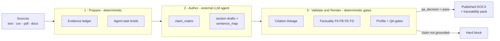

# Report Workflow

[](https://github.com/0Smallcat0/report-workflow/actions/workflows/ci.yml)


[](LICENSE)

**A deterministic verification layer that lets an LLM draft a report but refuses
to publish any claim it cannot trace to registered evidence.**

An LLM writes fluent prose and, every so often, invents a number, misquotes a
source, or cites a study that does not exist. That is fine for a chat reply and
unacceptable in a lab report, a client memo, or an admissions document. Report
Workflow puts a checkable boundary between *drafting* and *publishing*: the model
proposes, and a deterministic pipeline decides what is allowed to ship.

The Python package **does not call an LLM and needs no API key.** It owns source
parsing, the evidence ledger, artifact contracts, validation gates, DOCX
rendering, and traceability packaging. The external agent (Codex, Claude Code,
Hermes, …) owns judgment and drafting. Every publishable claim must be linked to
evidence that actually supports it, or it is hard-blocked before it reaches the
document.

## See it in 30 seconds

The gate is real code, not a description. This demo runs the exact factuality
checkers the pipeline uses against a tiny evidence ledger — no LLM, no network:

```bash
python examples/anti_hallucination_gate.py
```


Two failure modes an LLM ships silently — an **invented statistic** that cites
real evidence, and a **fabricated citation** to a source that does not exist —
are both caught with the specific gate and reason that stopped them. The honest,
well-grounded claim passes untouched, so the gate is discriminating, not merely
strict. Source: [`examples/anti_hallucination_gate.py`](examples/anti_hallucination_gate.py).

No local install needed:
[](https://colab.research.google.com/github/0Smallcat0/report-workflow/blob/master/docs/quickstart_demo.ipynb)
runs the gate in the browser, or open the repo in GitHub Codespaces (the
[dev container](.devcontainer/devcontainer.json) installs everything and runs
the demo on create).

## Red-team evidence: the catch rate is measured, not asserted

A gate that only sees honest drafts proves nothing. The adversarial benchmark
runs **58 hand-audited cases** — 20 honest controls and 38 hallucinated claims
across 13 attack families (fabricated citations, invented statistics, unit
swaps, fabricated quotes, precision inflation, cross-language laundering,
off-topic citations, status laundering, Chinese-text fabrication,
overclaiming, …) — through the exact gate stack, and compares two baselines on
the same corpus:

| Checker | Recall (hallucinations blocked) | False positives (honest blocked) | Precision |
| --- | --- | --- | --- |
| No gate (publish everything) | 0.0% | 0.0% | — |
| Citation-presence check (shallow RAG-style) | 10.5% | 0.0% | 100% |
| **Full deterministic gate stack** | **89.5%** (34/38) | **0.0%** (0/20) | **100%** |

All 13 targeted attack families are caught at 100%, with zero honest claims
wrongly blocked. The 2026-07-14 gate hardening closed three formerly documented
evasions (within-tolerance precision fudging, sub-10-character fabricated
quotes, cross-language citation laundering) and promoted them to regular attack
families. The remaining 4 misses are **documented evasions** (negation flips,
bare numbers without units, hedged reinterpretation, value misattribution) kept
in the corpus deliberately as the measured residual-risk boundary — see the
limitations section of [`docs/DESIGN.md`](docs/DESIGN.md). The corpus doubles
as a regression suite: expected verdicts are asserted in CI, and a sha256
verdict hash proves the stack is deterministic and reproduces cross-platform.

```bash
python scripts/run_adversarial_benchmark.py --check   # re-run from source, diff vs archive
```

Full tables: [`benchmarks/evidence/adversarial_2026-07-14/summary.md`](benchmarks/evidence/adversarial_2026-07-14/summary.md).

## Evidence it runs end-to-end

The seven-profile benchmark prepares, authors (with a deterministic synthetic
author), validates, and renders a report for every built-in profile from one
controlled source. The archived run is reproducible and machine-checkable:

```bash
python scripts/run_report_benchmarks.py --check   # validate archived evidence
python scripts/run_report_benchmarks.py           # regenerate from scratch
```

Archived results ([`benchmarks/evidence/full_benchmark_2026-05-13/summary.md`](benchmarks/evidence/full_benchmark_2026-05-13/summary.md)):

| Metric | Result |
| --- | --- |
| Profiles passing end-to-end | **7 / 7** |
| Claims verified against evidence | **42** (6 per profile), **0 blocked** |
| Unresolved citation-audit entries | **0** |
| Delivery QA decision | `pass` on every profile |
| Unit tests | **351 passing** |

Each report is packaged with its QA pack (`final_qa_summary`, factuality,
scholarly-quality, figure-visual, template-style, and render-layout reports) so
the publish decision is auditable after the fact, not just asserted.

Pages from a rendered engineering lab report produced by that benchmark — table of
contents, title and abstract, and a figure derived from the source data:


## How it works



1. **Prepare** parses sources and writes deterministic artifacts
   (`report_spec.json`, `report_profile.json`, `blueprint.json`,
   `source_registry.json`, `evidence_ledger.jsonl`, and `agent_tasks/*.md`).
2. **Author** — the external agent writes `claim_matrix.json`, `outline.json`,
   `section_drafts/*.md` (or `structured_drafts.json`), and `sentence_map.jsonl`.
3. **Validate and render** checks artifact completeness, section contracts,
   citation linkage, factuality, profile policy, figure contracts, and QA gates,
   then renders. `render` runs only after the validated checkpoint records
   `qa_decision=pass`, a passing `qa_summary.json`, a clean
   `factuality_report.json`, and no unresolved citation audit entries.

The factuality gate is layered: **FA** confirms claim/evidence/sentence linkage
and rejects fabricated citations; **FB** requires quantitative evidence for
statistical claims; **FE** (deep-audit) compares claim content against evidence
content and catches invented numbers and quoted phrases that are not in the
source; **FD** checks wording strength against evidence grade. See
[`src/report_workflow/nodes/factuality_check.py`](src/report_workflow/nodes/factuality_check.py).

## Install

```powershell
pip install -r requirements.txt
pip install -e .
```

Required external tool for full-fidelity rendering:

```powershell
pandoc --version
```

Pandoc 3.x is the primary DOCX renderer. Without pandoc, the workflow falls back
to a limited `python-docx` renderer and output may have degraded table, list, and
layout fidelity.

Optional integrations:

- `mmdc` (`npm install -g @mermaid-js/mermaid-cli`) for Mermaid diagrams.
- `TAVILY_API_KEY`, `SERPER_API_KEY`, or `SERPAPI_API_KEY` for optional web research.
- `notebooklm-py` for optional NotebookLM sync.
- `pip install -e .[mcp]` for the MCP server (`report-workflow-mcp`).

## CLI

```powershell
report-workflow prepare `
  --prompt "write an engineering lab report from these sources" `
  --source C:\path\to\source.txt `
  --output C:\path\to\out `
  --profile engineering_lab_report `
  --preflight-decisions C:\path\to\preflight_decisions.json `
  --template-field course_name="Control Systems"

report-workflow validate --job-id <job_id>
report-workflow render --job-id <job_id>
report-workflow status --job-id <job_id>
report-workflow run --job-id <job_id>
```

`prepare` requires a `--preflight-decisions` JSON record confirming the user's
install, degraded-render, and optional-feature decisions. Required dependencies
must actually pass preflight before start; a decision string alone does not
override a still-missing dependency. This mirrors the agent-skill
`preflight_decisions` contract instead of silently starting from the raw CLI.

`--source PATH:ROLE` may be repeated. Valid roles are `source_data` and
`base_document`. The role suffix is parsed only when the trailing token exactly
matches a valid role, so Windows paths such as `C:\path\to.txt` are safe.

CLI exit codes:

- `0`: success
- `1`: crash
- `2`: hard-block validation failure
- `3`: waiting for user decisions or agent-authored artifacts

## MCP server

Any MCP-capable agent (Claude Code, Codex, Cursor, custom harnesses) can call
the same deterministic gates as tools — draft with its own judgment, then ask
`verify_claims` whether each claim is allowed to ship:

```bash
pip install "report-workflow[mcp] @ git+https://github.com/0Smallcat0/report-workflow"
claude mcp add report-workflow -- report-workflow-mcp
```

Tools: `verify_claims` (per-claim verdict with the gate and reason),
`list_report_profiles`, `get_workflow_status`. Details and payload examples:
[`docs/mcp.md`](docs/mcp.md).

## Report profiles

`report_profile` is the only public report-shape selector. Built-in profiles:
`engineering_lab_report`, `academic_paper`, `business_report`, `proposal`,
`admissions_report`, `admissions_project_report`, and `custom`. The pipeline
infers a profile from the prompt unless `--profile` or `report_profile` is given.

Profile purposes and strictness are documented in
`agent_skill/reference/profiles.md`; the registry lives in
`src/report_workflow/profiles.py`.

## Reference templates

Profiles control reference-template behavior. The default mode is
`style_reference` (use a DOCX as a style/layout reference); if the user asks to
exactly preserve the cover or format, the workflow upgrades to `fixed_template`.
A profile contract has priority over prompt and template hints. Engineering
exact-cover handling is detailed in `agent_skill/reference/engineering-lab.md`.

## Quality gates

Core hard gates: sources must register and parse; the evidence ledger must be
non-empty; claims must cite valid evidence IDs; claim status cannot be `blocked`,
`unverified`, or `disputed`; evidence-backed sentences must contain matching
`[CITE:<id>]` placeholders; citation audits must resolve; placeholder prose and
fake metadata are blocked; and render requires `qa_decision=pass`. Profile
policies adjust strictness for front matter, abstract structure, citation style,
reference verification, and figure/table contracts. The authoritative gate list
lives in [AGENTS.md](AGENTS.md).

## Benchmarks

Use `benchmarks/` when improving report quality across profiles. Run
`python scripts/run_report_benchmarks.py` for the seven-profile
prepare-author-validate-render benchmark, or
`python scripts/run_report_benchmarks.py --check` to validate archived evidence
without rerunning. `python scripts/run_adversarial_benchmark.py` regenerates
the adversarial catch-rate evidence (`--check` verifies it from source). The
benchmark-first optimization method and gap taxonomy are documented in
`agent_skill/reference/benchmarking.md`.

## Tests

```powershell
python -m compileall -q src tests
python -m unittest discover -s tests -v
```

## Design philosophy

Report Workflow is one instance of a general idea: **evidence-bounded
generation.** Wherever a claim must trace to a source — an engineering lab
report, a financial memo where every number cites a filing, a regulatory
document, an admissions essay grounded in a real project — the trustworthy part
is not the fluent draft but the layer that can *prove* each statement and refuse
the ones it cannot. Keeping that layer deterministic (no LLM in the checker)
makes the verdict reproducible and auditable rather than another probabilistic
opinion.

This repository was specified, integrated, and verified by its author with heavy
use of coding agents for implementation. The deterministic gates and the
benchmark harness exist precisely so that the human, not the model, holds the
final "is this correct?" decision — the same principle the tool enforces on the
documents it produces.

## Repository guide

- **Why it is built this way + measured limits** → [`docs/DESIGN.md`](docs/DESIGN.md)
  (threat model, architecture rationale, evaluation, honest limitations).
- **Operating the skill to generate a report** → [`agent_skill/SKILL.md`](agent_skill/SKILL.md)
  and its `reference/` files.
- **Developing this repository** → [AGENTS.md](AGENTS.md) (authoritative contract:
  layout, stage lists, artifact contract, hard gates, extension points).
- **Contributor entry point** → [AGENT_ONBOARDING.md](AGENT_ONBOARDING.md).

Final artifacts are packaged under `output/<slug>--<job_id>/published/`, with
delivery QA in `published/qa/`. See [AGENTS.md](AGENTS.md) for the canonical stage
lists and the full QA artifact contract.
