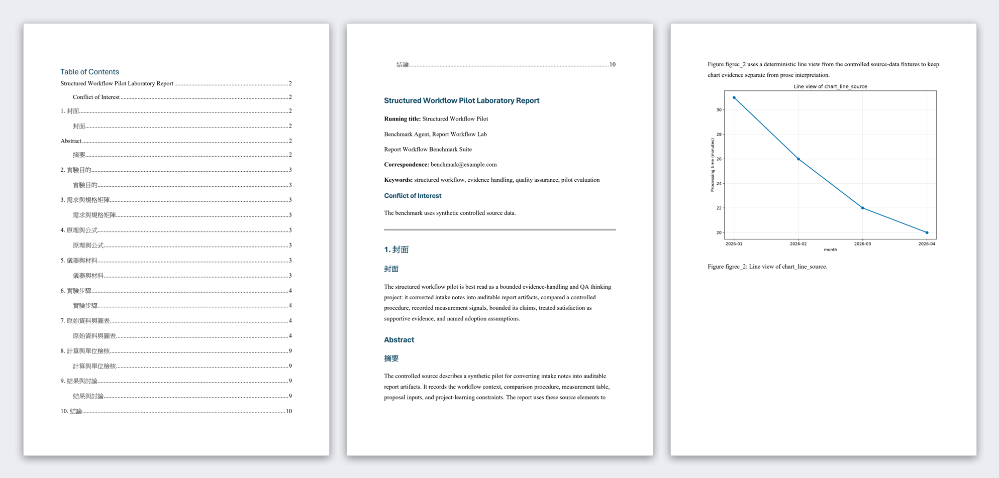
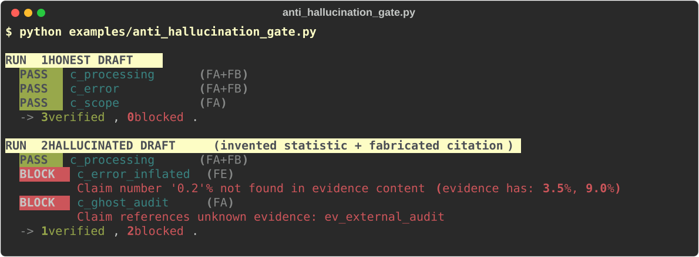

# Report Workflow

[](https://github.com/0Smallcat0/report-workflow/actions/workflows/ci.yml)


[](LICENSE)

**Turn your sources into a report you can hand in — and refuse to ship a single
claim that cannot be traced back to them.**

Give it your material and a prompt. Out comes a finished DOCX with a table of
contents, page numbers, real Word tables, and your department's own template, in
English or Chinese. Every publishable sentence has to link to registered
evidence, so no invented number and no fabricated citation reaches the page.

The package **calls no LLM and needs no API key.** It owns source parsing, the
evidence ledger, the gates, and rendering; your agent (Claude Code, Codex, …)
owns the judgment and the writing.

```bash
pip install report-workflow
```

## What it produces



Seven document types — lab report, academic paper, business report, proposal,
two admissions formats, and a general one. Each carries what its reader actually
rewards, and the quantitative analysis a grader looks for (a fitted slope
against theory, R², a budget total) is computed from your data and registered as
citable evidence, so the agent never has to invent it.

Sample output, the profile list, Chinese-document handling, templates, and the
gate list: **[docs/OUTPUT.md](docs/OUTPUT.md)**.

## The gate, standalone

No pipeline, no schema, no API key — pass an answer and the source it was
supposed to be grounded in:

```python
from report_workflow import verify

result = verify(
    answer="The error rate fell to 0.2% [1].",
    sources={"1": "The error rate fell to 3.5% under the structured workflow."},
)
result["publishable"]                      # False
result["sentence_results"][0]["checker"]   # "FE"
result["sentence_results"][0]["reason"]    # "Claim number '0.2'% not found in evidence content (evidence has: 3.5%)..."
```

A pure function of `(answer, sources)`: same verdict every run, zero tokens,
works offline and in CI. Sentences are split (English and CJK) and scoped to the
sources their `[id]` markers cite; a marker matching no source is a fabricated
citation and blocks.

**Scope, stated plainly.** A *fidelity gate*, not a general hallucination
detector: it catches invented numbers, fabricated citations, misquotes, and unit
swaps, but it does not judge meaning, so a fluent paraphrase that reverses the
source is out of scope. That boundary is measured on 10,000 outside pairs, not
hidden — with catch rates, baselines, and the comparison to LLM-as-judge tools:
**[docs/EVIDENCE.md](docs/EVIDENCE.md)**.

## See it run

Both scripts below live in this repository, so clone it first — `pip install`
ships the package, not the examples.

Three files and one sentence in, a finished DOCX out — table of contents, page
numbers, a real Word table, a chart drawn from your numbers, and a QA pack
saying why each sentence was allowed to ship:

```bash
python examples/source_to_report.py
```

Swap the three paths at the top of that script for your own material. Details
and the honest note about what the script does on your agent's behalf:
[examples/README.md](examples/README.md).

And the gate on its own:

```bash
python examples/anti_hallucination_gate.py
```



An invented statistic that cites real evidence and a fabricated citation are
both hard-blocked with the gate and reason that stopped them; the honest claim
passes untouched. No local install needed:
[](https://colab.research.google.com/github/0Smallcat0/report-workflow/blob/master/docs/quickstart_demo.ipynb)

## Install

`pip install report-workflow` covers the gates, `verify()`, and the
`report-workflow` CLI — the whole source-to-DOCX pipeline. Add pandoc 3.x for
full rendering; without it the renderer falls back to `python-docx` with
degraded table and layout fidelity. Clone the repository if you want the
example scripts, the benchmarks, or to develop against it.

```powershell
pip install -r requirements.txt
pip install -e .
pandoc --version
```

Optional: `pip install -e .[mcp]` for the MCP server, `mmdc` for Mermaid
diagrams, `TAVILY_API_KEY` / `SERPER_API_KEY` / `SERPAPI_API_KEY` for web
research, `notebooklm-py` for NotebookLM sync.

If the `report-workflow` command fails silently — common on Windows when a stale
`report-workflow.exe` sits on PATH — use `python -m report_workflow`, which
always runs against the interpreter you invoke.

## CLI

```bash
report-workflow prepare --prompt "write an engineering lab report" \
  --source source.txt --output out --profile engineering_lab_report \
  --preflight-decisions preflight.json
report-workflow validate --job-id <job_id>
report-workflow render   --job-id <job_id>
```

Exit codes: `0` success, `1` crash, `2` hard-block, `3` waiting for user
decisions or agent-authored artifacts. Add `--reference-docx your.docx` to
follow your own Word template.

## MCP server

Any MCP-capable agent can call the same gates as tools — draft with its own
judgment, then ask `verify_claims` whether each claim may ship. Payloads:
[docs/mcp.md](docs/mcp.md).

```bash
claude mcp add report-workflow -- report-workflow-mcp
```

## Where to go next

- **What the output looks like, profiles, templates, gates** → [docs/OUTPUT.md](docs/OUTPUT.md)
- **Measured catch rates and honest limits** → [docs/EVIDENCE.md](docs/EVIDENCE.md)
- **Why it is built this way, threat model** → [docs/DESIGN.md](docs/DESIGN.md)
- **Driving it from an agent** → [agent_skill/SKILL.md](agent_skill/SKILL.md)
- **Developing this repository** → [AGENTS.md](AGENTS.md) (authoritative contract)

Specified, integrated, and verified by its author, with coding agents doing much
of the implementation — the deterministic gates and the benchmark harness exist
so a human, not a model, holds the final "is this correct?" decision.
