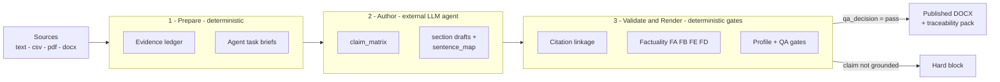

# What comes out

## A graded document reads like this

The discussion section of a cantilever-beam lab report, rendered by the pipeline
from a course handout and a five-row measurement CSV:

> Fitting the measurements puts a number on how closely they track the model. A
> least-squares fit of measured deflection against load gives a slope of 0.298
> with R² = 0.9999, against the theoretical slope of 0.29. [1] Across the five
> steps the error ranges from 2.6 to 4.8 with a mean of 3.5. [1] The coefficient
> of determination is high enough that the linear assumption is not in question,
> and the excess slope is consistent across the range — the deviation is
> systematic, not scatter.
>
> Two features of the apparatus explain a systematic excess of this kind. The
> model assumes a perfectly rigid fixed end, whereas the clamp has finite
> stiffness and rotates slightly under load. The dial indicator also rests
> against the beam with a small contact force. Both add deflection the
> rigid-clamp model does not account for, and both act at every load — which is
> why the offset appears at all five steps rather than at isolated points.

The slope and R² are not the agent's own arithmetic: the pipeline computed them
from the CSV and registered them as evidence, so the quantitative analysis a
grader looks for is citable instead of unsupported. Each paragraph opens with
its point and closes with the takeaway, and the discussion runs result →
quantitative comparison → mechanism → verdict — the shape university lab rubrics
grade against.

## Aiming at "good", not just "not wrong"

Passing the gates means a document is not *wrong*. Three mechanisms aim it at a
document its reader rates highly. All three are guidance, not gates:

- **Reader rubrics.** Each profile's authoring brief states what its reader
  rewards: quantified comparison over description for a lab professor,
  conclusion-first for a manager, concrete incidents over adjectives for an
  admissions committee, one plainly stated contribution for a reviewer.
- **Structure discipline**, distilled from published standards — every paragraph
  Context → Content → Conclusion ([Kording & Mensh, *PLOS Comput Biol* 2017](https://journals.plos.org/ploscompbiol/article?id=10.1371/journal.pcbi.1005619));
  figures carrying the results and prose explaining them ([Whitesides, *Adv.
  Mater.* 2004](https://www.gmwgroup.harvard.edu/publications/whitesides-group-writing-paper));
  answer-first with an SCQA opening for business writing (Minto's Pyramid
  Principle); depth on a few defining experiences for admissions documents
  ([MIT CommLab](https://mitcommlab.mit.edu/eecs/commkit/graduate-school-statement-of-purpose/),
  [Cornell](https://gradschool.cornell.edu/inclusion/recruitment/prospective-students/writing-your-statement-of-purpose/)).
- **Derived statistics as citable evidence.** Least-squares slope against the
  theoretical slope, R², the error range and mean, and the total of a budget
  column are computed from structured data and registered as ledger entries —
  because a number the agent worked out by itself has nothing to cite, and is
  exactly what the factuality gates block.

## Report profiles

`report_profile` is the only public report-shape selector. Built-in profiles:
`engineering_lab_report`, `academic_paper`, `business_report`, `proposal`,
`admissions_report`, `admissions_project_report`, and `custom`. The pipeline
infers a profile from the prompt unless `--profile` or `report_profile` is
given.

Profile purposes and strictness are documented in
`skills/report-workflow/reference/profiles.md`; the registry lives in
`src/report_workflow/profiles.py`.

## Chinese documents

Document language is detected deterministically from the source evidence.
Chinese-dominant sources produce a fully Chinese deliverable: every blueprint
section carries a `title_zh`, so headings render as 「1. 執行摘要 … 參考文獻」
instead of leaking English defaults; the abstract length gate counts CJK
characters against CJK-scaled bounds; sentence spacing follows Chinese
typography rather than English; figure references (「如圖 1」) and Chinese
ordinal headings (「一、」「（三）」) are recognized by the quality gates.
English documents are byte-for-byte unchanged.

Every built-in profile has been exercised end-to-end with a Chinese document
(lab report, research proposal, work report, business proposal, hardware
evaluation, admissions project report) plus an English journal paper.

## Reference templates

Bring your own formatting: pass `--reference-docx your.docx` on `prepare`,
`render`, or `run` (agent tools accept `reference_docx`) and the output follows
that document's styles — fonts, sizes, margins, header/footer (including its
page-number setup), and table styles. Section structure still comes from the
report profile, every content gate still applies, and an unusable template
hard-blocks the render instead of silently falling back to the built-in look.

Profiles control reference-template behavior. The default mode is
`style_reference` (use a DOCX as a style/layout reference); if the user asks to
exactly preserve the cover or format, the workflow upgrades to `fixed_template`.
A profile contract has priority over prompt and template hints. Engineering
exact-cover handling is detailed in `skills/report-workflow/reference/engineering-lab.md`.

## Quality gates

Core hard gates: sources must register and parse; the evidence ledger must be
non-empty; claims must cite valid evidence IDs; claim status cannot be
`blocked`, `unverified`, or `disputed`; evidence-backed sentences must contain
matching `[CITE:<id>]` placeholders; citation audits must resolve; placeholder
prose and fake metadata are blocked; and render requires `qa_decision=pass`.
Profile policies adjust strictness for front matter, abstract structure,
citation style, reference verification, and figure/table contracts.

The factuality gate is layered: **FA** confirms claim/evidence/sentence linkage
and rejects fabricated citations; **FB** requires quantitative evidence for
statistical claims; **FE** (deep-audit) compares claim content against evidence
content and catches invented numbers and quoted phrases that are not in the
source; **FD** checks wording strength against evidence grade. See
[`src/report_workflow/nodes/factuality_check.py`](../src/report_workflow/nodes/factuality_check.py).

The authoritative gate list lives in [AGENTS.md](../AGENTS.md).

## How the pipeline is staged

1. **Prepare** parses sources and writes deterministic artifacts
   (`report_spec.json`, `report_profile.json`, `blueprint.json`,
   `source_registry.json`, `evidence_ledger.jsonl`, and `agent_tasks/*.md`).
2. **Author** — the external agent writes `claim_matrix.json`, `outline.json`,
   `section_drafts/*.md` (or `structured_drafts.json`), and `sentence_map.jsonl`.
3. **Validate and render** checks artifact completeness, section contracts,
   citation linkage, factuality, profile policy, figure contracts, and QA gates,
   then renders. `render` runs only after the validated checkpoint records
   `qa_decision=pass`, a passing `qa_summary.json`, a clean
   `factuality_report.json`, and no unresolved citation audit entries.

Final artifacts are packaged under `output/<slug>--<job_id>/published/`, with
delivery QA in `published/qa/`.
